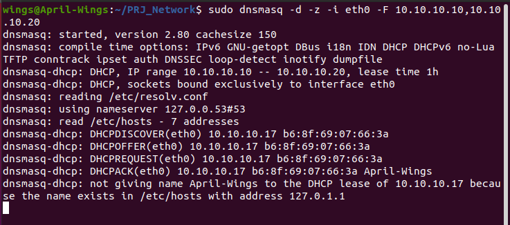
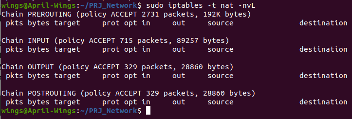
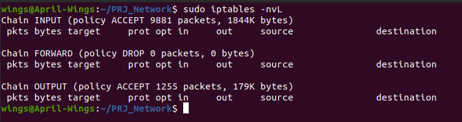
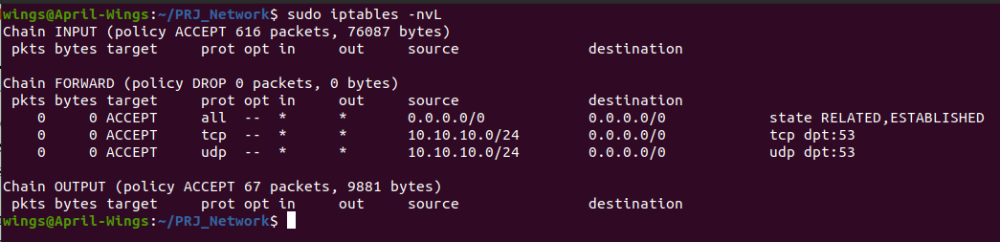
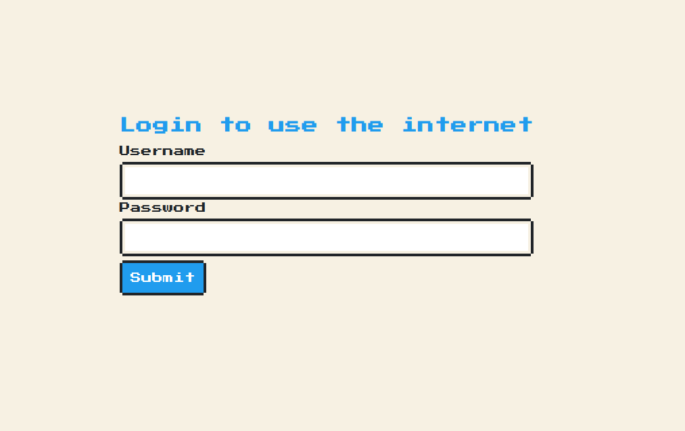
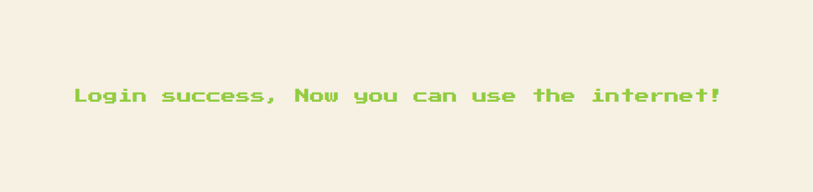
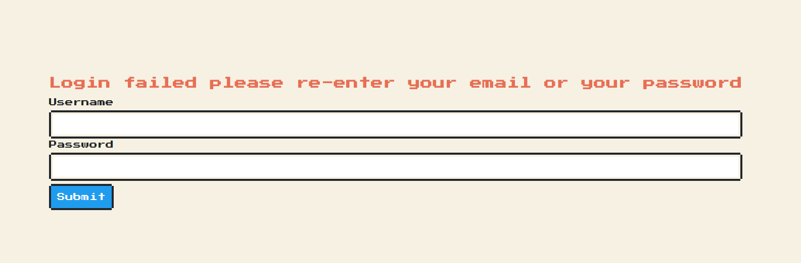

---
title: "Report Reseaux Advance Projet"
author: \textbf{DO Duy Huy Hoang} \newline
        \textbf{NGUYEN Thi Mai Phuong} \newline
        \newline
        \newline
        \textit{University of Limoges} \newline 
date: \today
titlepage: false
header-includes: |
    \usepackage{multicol}
    \usepackage{graphicx}
footer-left: DO Hoang et NG Phuong
mainfont: NewComputerModern
sansfont: NewComputerModern
monofont: Dank Mono
caption-justification: centering
...
\pagenumbering{Roman} 

\newpage{}

\listoffigures
\newpage{}
\tableofcontents
\newpage{}

\pagenumbering{arabic} 

# I. Introduction 

## Context and Motivation

A captive portal is a web page accessed with a web browser that is displayed to newly connected users of a Wi-Fi or wired network before they are granted broader access to network resources. Captive portals are commonly used to present a landing or log-in page which may require authentication, payment, acceptance of an end-user license agreement, acceptable use policy, survey completion, or other valid credentials that both the host and user agree to to redirect users of a network that provides outbound internet access to a web page that displays the terms of service.

## Objectives

In this project, we have done the following:

- Configuring 
    - The network
    - DHCP Server
    - DNS service
    - Firewall
    - TCP Server

\newpage{}

# II. Configuring network

In this section, we present our network structure which is described in the below figure. We create two machine hA and hB which are connected to a switch mS. mS connect to our VM which act as a router with firewall.


# III. Configuring DHCP Server and DNS Service

In order to ensure the configuration by DHCP with netns connected in the private network 10.10.10.0/24. We use `dnsmasq` which provides a DNS server suitable for resource constrained routers and firewalls.

To setup dnsmasq for DHCP, we execute the following command for binding our VM to `meth0` interface.

```bash
sudo dnsmasq -d -z -i meth0 -F 10.10.10.10,10.10.10.20
```



After that, we might want to request a dynamic IP for `hA-eth0` and `hB-eth0` by using these command:

```bash
sudo ip netns exec hA dhclient -d hA-eth0 
sudo ip netns exec hB dhclient -d hB-eth0
```

For tracing the packet exchanges, we use tcpdump on the DHCP server for port 67 or 68, the result is shown below

{ width=70% }

# III. Configuring Firewall

For configuring the firewall, we set some rules in NAT and FILTER table.

```bash
sudo iptables -I FORWARD -m state --state ESTABLISHED,RELATED -j ACCEPT
sudo iptables -t nat -A POSTROUTING -s 10.10.10.0/24 -j MASQUERADE (private network)
sudo iptables -A FORWARD -s 10.10.10.0/24 -p tcp --dport 53 -j ACCEPT
sudo iptables -A FORWARD -s 10.10.10.0/24 -p udp --dport 53 -j ACCEPT
```

For redirecting traffic from the private network to the destination of the Web:

```bash
sudo iptables -t nat -A PREROUTING -s 10.10.10.0/24 -p tcp --dport 80 -j DNAT --to-destination 10.10.10.1:8080
sudo iptables -t nat -A PREROUTING -s 10.10.10.0/24 -p tcp --dport 443 -j DNAT --to-destination 10.10.10.1:8080
```




The result below shows an output of the "iptables -nL" command for the different modified tables as before config, after config and after authentication.






# IV. TCP Server

In this section, we implement a TCP server which serve a login page for client request to access a website in external network.
In order to authenticate, we use a perform secure authentication with CAS Unilim server by using `LemonLDAP`

```python
def getCookies(username, password, token):
    cookieProcessor = urllib.request.HTTPCookieProcessor()
    opener = urllib.request.build_opener(cookieProcessor)
    data = urllib.parse.urlencode({'user': username, 'password': password, 'token': token})
    request = urllib.request.Request('https://cas.unilim.fr', bytes(data, encoding='ascii'))
    reponse = opener.open(request)
    cookies = [c for c in cookieProcessor.cookiejar if c.name == 'lemonldap']
    return cookies
```

If the client logins successfully, we will update our firewall with the `remote_IP` and redirect to a successful webpage otherwise, the client will be returned to a login page with a alert message.

{ width=90% }

{ width=90% }

{ width=90% }

# Conclusion and Future works

## Conclusion

In this project, we have created a captive portal network with the flowing task:

- Setup and configuring the network as the project description
- Setup a DHCP and DNS server and Configuring Firewall in a precise way to protect the local network.
- Create TCP server

## Future works

- Implementing more rules and a better network structure.
- Redirect page to the destination website (instead of successful page).

# References

[Captive portal Wiki](https://en.wikipedia.org/wiki/Captive_portal)

[Captive portal by science direct](https://www.sciencedirect.com/topics/computer-science/captive-portal)

